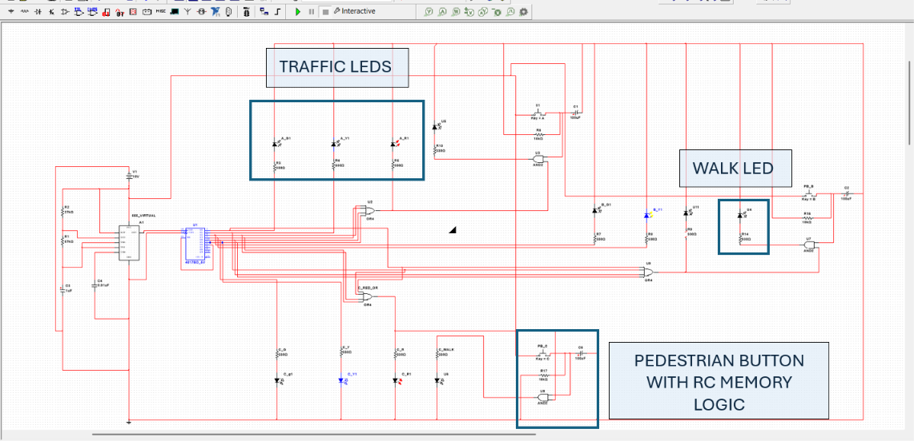
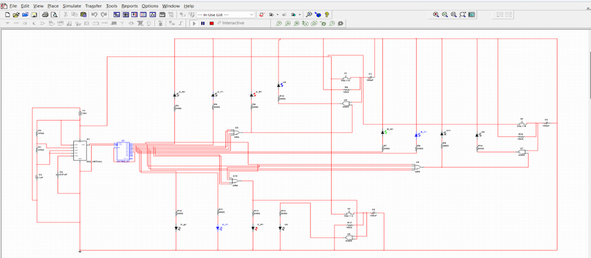

# Traffic Light Controller with Pedestrian Button

A digital logic-based 3-way traffic light controller with pedestrian crossing functionality. The system controls traffic lights for three roads and uses pedestrian push buttons with RC memory logic to activate walk signals safely during red-light phases.

## Overview

This project was completed as part of a university digital logic and engineering coursework project.

The system represents a 3-way intersection with Road A, Road B, and Road C. Each road has red, yellow, and green traffic light outputs. Pedestrian push buttons allow crossing requests to be stored temporarily using RC memory, so the walk light activates only when the corresponding road is in a safe red-light state.

The controller was designed using a Moore finite state machine, a 555 timer clock circuit, a CD4017 decade counter, and logic gates.

## Features

- 3-way traffic light control
- Moore finite state machine design
- 555 timer-based clock generation
- CD4017 decade counter state sequencing
- Red, yellow, and green LED outputs for three roads
- Pedestrian push-button inputs
- RC memory logic for pedestrian request storage
- Walk light activation only during safe red-light states
- Multisim simulation and testing
- Automatic return to normal traffic sequence after pedestrian cycle

## Tools and Technologies

- Multisim
- 555 Timer IC
- CD4017 Decade Counter IC
- 7408 AND Gate IC
- 7432 OR Gate IC
- LEDs
- Push buttons
- Resistors and capacitors
- Finite State Machine design
- Digital logic circuit design

## System Operation

1. The 555 timer generates clock pulses for the traffic light sequence.
2. The CD4017 decade counter advances through the traffic states.
3. Each state corresponds to a traffic phase for Road A, Road B, or Road C.
4. The traffic sequence cycles through green, yellow, and red outputs for each road.
5. Logic gates combine counter outputs to generate the correct red-light signals.
6. When a pedestrian button is pressed, the RC memory circuit stores the request.
7. The walk light turns on only when the selected road is red.
8. After the pedestrian cycle ends, the system returns automatically to normal traffic operation.

## Finite State Machine

The controller uses a Moore finite state machine, where the traffic light outputs depend only on the current state.

| State | Road A | Road B | Road C |
|---|---|---|---|
| Q0 | Green | Red | Red |
| Q1 | Yellow | Red | Red |
| Q2 | Red | Green | Red |
| Q3 | Red | Yellow | Red |
| Q4 | Red | Red | Green |
| Q5 | Red | Red | Yellow |

## Pedestrian Button Logic

The pedestrian system uses RC memory logic to store a button press temporarily. This prevents the traffic sequence from being interrupted immediately.

The walk light turns on only when:

- the pedestrian request has been stored
- the corresponding road is red

This allows the current traffic phase to finish before the pedestrian crossing signal activates.

## My Contribution

- Designed and analysed the finite state machine for the 3-way traffic sequence.
- Worked on Multisim circuit simulation and testing.
- Contributed to pedestrian push-button and RC memory logic design.
- Contributed in testing normal traffic operation and pedestrian request behaviour.
- Helped verify system behaviour across green, yellow, and red-light states.
- Documented circuit operation, testing methodology, and results.

## Project Media

### Multisim Circuit

### Pedestrian Walk Light Test

This test demonstrates the pedestrian request memory logic. `WALK_A` becomes active during state `Q2`, where Road A is red, showing that a pedestrian request is not served immediately during unsafe traffic phases. Instead, the request is stored and the walk signal is activated only when the road reaches a safe red-light state.

